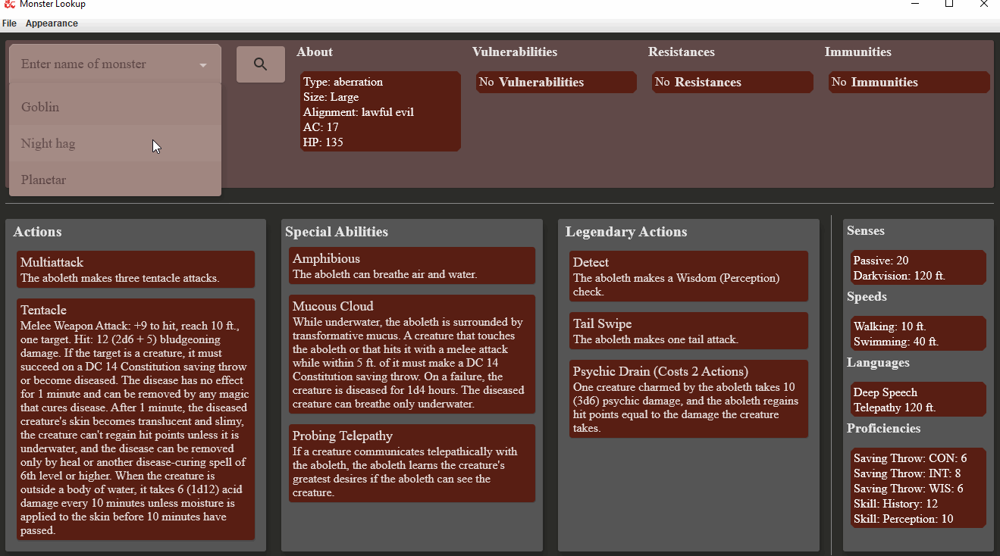

# MonsterLookup
___
A side project to familiarise myself with Compose.

## About

Desktop app that lets you search for monsters from Dungeons and Dragons and easily view them and their actions, abilities and stats.
For your DM:ing needs. Currently only supports monsters and spells that pops up when you select an ability containing spells.

The app UI is built with [Compose Multiplatform](https://www.jetbrains.com/lp/compose-mpp/) and supports both dark and light themes.
Uses an embedded H2 database for local storage to cache recently fetched monsters and spells.

The information is fetched from an open Dungeons and Dragons [API](https://www.dnd5eapi.co/) 
that lets you fetch information from monsters, items, spells, etc in JSON format. 

## Images
<figure>

<figcaption>Display Screen</figcaption>
</figure>
 
<figure>

<figcaption>Pop up</figcaption>
</figure>
 
<figure>
  
<figcaption>Starting Screen</figcaption>
</figure>

## Planned

- Fetch information for spells and other abilities that come packed in other actions/abilities and display them
- Add a loading animation when searching
- Add proper fonts
- Make better use of themes by moving shapes and typography into it
- UI Tests
