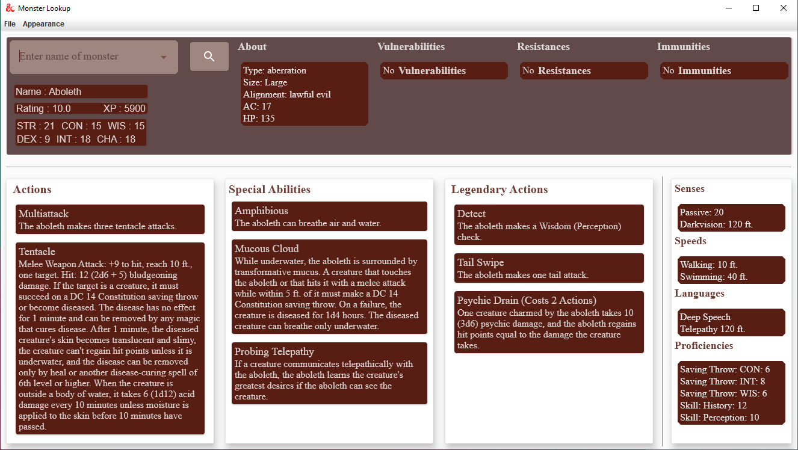
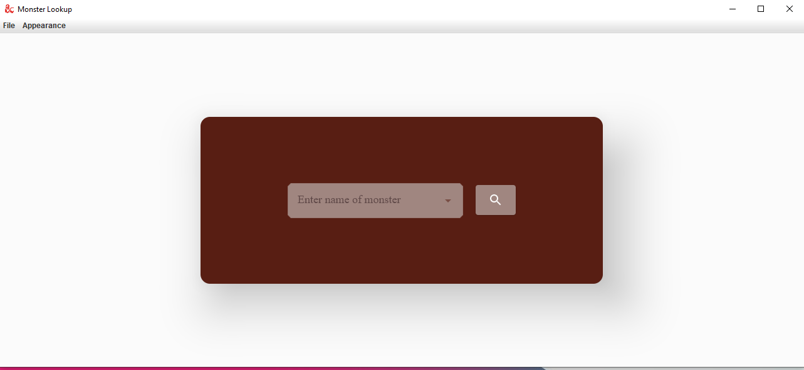

# MonsterLookup
___
[![Kotlin version][kotlin_img]][kotlin_url]
[![Compose version][compose_img]][compose_url]

A side project to familiarise myself with Compose.

## About

Desktop app that lets you search for monsters from Dungeons and Dragons and easily view them and their actions, abilities, stats
for your DM:ing needs. Currently, only supports monsters and spells that pops up when you select an ability containing spells.
Actions and abilities are displayed in scrollable lists with clickable items for actions with attack rolls, which will display
a popup with attack roll results and damage.

The app UI is built with [Compose Multiplatform](https://www.jetbrains.com/lp/compose-mpp/) and supports both dark and light themes.
Uses an embedded database for local storage to cache recently fetched monsters and spells.

The information is fetched from an open Dungeons and Dragons [API](https://www.dnd5eapi.co/) 
that lets you fetch information from monsters, items, spells, etc. 

## Install

Use gradle to build or run the project using 

```
# Create runnable executable for your OS
gradle createdistributable
# Or
gradlew createdistributable

# To create an installer for windows
# gradle packageMsi 

# To build project
gradle build
```

## Images
<figure>

<figcaption>Display Screen</figcaption>
</figure>
<br>
<figure>

<figcaption>Pop up</figcaption>
</figure>
<br>
<figure>
  
<figcaption>Starting Screen</figcaption>
</figure>


## Dependencies

- Local Storage: [H2](https://github.com/h2database/h2database)
- Local Storage ORM: [Exposed](https://github.com/JetBrains/Exposed)
- Dependency Injection: [Koin](https://github.com/InsertKoinIO/koin)
- Logging: [Kotlin-logging](https://github.com/MicroUtils/kotlin-logging)

## Planned

- Build window decorator into app bar
- Dice roll animation
- Differentiate clickables with icons
- General dice roller
- ~~UI Tests~~ When UI tests are more developed for compose desktop


[compose_url]: https://github.com/JetBrains/compose-jb/releases/tag/v1.2.0-alpha01-dev774
[compose_img]: https://img.shields.io/static/v1?style=for-the-badge&message=Compose&color=4285F4&logo=Jetpack+Compose&logoColor=FFFFFF&label=
[kotlin_url]: https://github.com/JetBrains/kotlin/releases/tag/v1.7.10
[kotlin_img]: https://img.shields.io/github/v/release/Jetbrains/kotlin?color=7f53ff&label=Kotlin&logo=kotlin&logoColor=7f53ff&style=for-the-badge